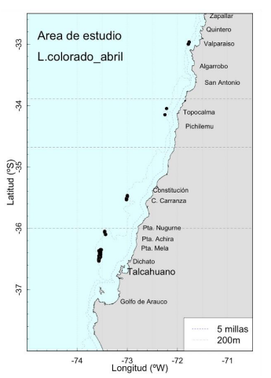

EPOMAR
================

# Repositorio

<figure>

<figcaption aria-hidden="true">Evaluación de Poblaciones Marinas
Explota</figcaption>
</figure>

El interés en investigación del laboratorio EPOMAR es en dinámica de
poblaciones explotadas, biología pesquera y evaluación de stock, con
énfasis en el desarrollo y aplicación de enfoques que faciliten tanto la
comprensión de los cambios de abundancia como la toma de decisiones para
el manejo de pesquerías.

### Informe Técnico Vol. 7 No 2 (2022)

# Indicadores biológico-pesqueros del langostino colorado y langostino amarillo

### Mayo de 2022

#### Convenio EPOMAR UdeC – Camanchaca Pesca Sur

## Presentación

En este informe se comunican los aspectos biológico-pesqueros de
langostino colorado y amarillo en las capturas de la flota de la
Compañía Pesquera Camanchaca Pesca Sur, durante el mes de abril de 2022.
Los indicadores dicen relación con la distribución espaciotemporal de la
captura, esfuerzo de pesca y rendimientos de pesca. De igual modo, se
comunican cambios espaciales en la estructura de tallas, talla promedio
y peso promedio.

### 1. Aspectos Pesqueros

#### 1.1. Actividad pesquera

Las operaciones de pesca realizadas durante abril cubrieron los
caladeros ubicados a lo largo de las regiones de Valparaíso, O’Higgins,
Maule y Biobío, destacando la operación dirigida a langostino colorado a
la cuadra de Valparaíso, Topocalma, Carranza, Chanco, Itata y la isla
Sta. María (Fig. 1).

<figure>

<figcaption aria-hidden="true">Figura 1. Distribución espacial de los
lances de pesca orientados a langostino colorado y langostino amarillo
en abril, 2022</figcaption>
</figure>
