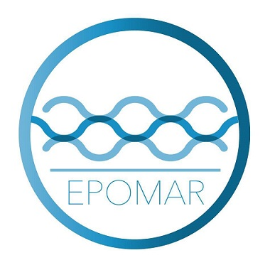
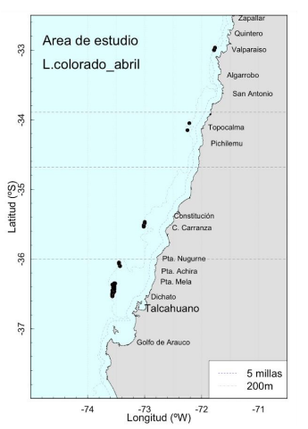
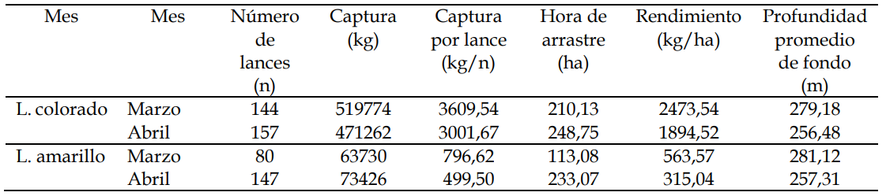

<html lang="es">
<head>
<meta charset="UTF-8">
<meta http-equiv="X-UA-Compatible" content="IE=edge">
<meta name="viewport" content="width=device-width, initial-scale=1.0">
<link rel="shortcut icon" href="img/favicon_Epo2_16x16.png" type="image/x-icon">
<link rel="stylesheet" href="css/estilos1.css">
<link rel="preconnect" href="https://fonts.googleapis.com">
<link rel="preconnect" href="https://fonts.gstatic.com" crossorigin>
<link href="https://fonts.googleapis.com/css2?family=Open+Sans:wght@300&display=swap" rel="stylesheet">
</head>
<header>
<nav>
<a href="https://www.facebook.com/labEPOMAR/">Inicio</a>
<a href="#">Acerca de</a> <a href="#">Portafolio</a>
<a href="#">Servicios</a>
<a href="https://www.facebook.com/labEPOMAR/">Contacto</a>
</nav>
<section class="textos-header">
<h1>
EPOMAR
</h1>
<h2>
Laboratorio Evaluación de Poblaciones Marinas Explotadas
</h2>
<h3>
Universidad de Concepción
</h3>
</section>

<svg viewBox="0 0 500 150" preserveAspectRatio="none" style="height: 100%; width: 100%;">
<path d="M-2.82,-2.44 C227.42,288.66 301.35,-101.13 500.00,49.98 L500.00,150.00 L0.00,150.00 Z" style="stroke: none; fill: #fff;"></path>
</svg>

</header>
</html>

</img>

El interés en investigación del laboratorio EPOMAR es en dinámica de
poblaciones explotadas, biología pesquera y evaluación de stock, con
énfasis en el desarrollo y aplicación de enfoques que faciliten tanto la
comprensión de los cambios de abundancia como la toma de decisiones para
el manejo de pesquerías.

<section class="informe">

<h5>
Informe Técnico Vol. 7 No 2 (2022)
</h5>
<h6>
Indicadores biológico-pesqueros del langostino colorado y langostino
amarillo
</h6>
<h5>
Mayo de 2022
</h5>
<h5>
Convenio EPOMAR UdeC – Camanchaca Pesca Sur
</h5>

<h2>
Presentación
</h2>

En este informe se comunican los aspectos biológico-pesqueros de
langostino colorado y amarillo en las capturas de la flota de la
Compañía Pesquera Camanchaca Pesca Sur, durante el mes de abril de 2022.
Los indicadores dicen relación con la distribución espaciotemporal de la
captura, esfuerzo de pesca y rendimientos de pesca. De igual modo, se
comunican cambios espaciales en la estructura de tallas, talla promedio
y peso promedio.

<h3>

1.  Aspectos Pesqueros
    </h3>

<h4>
1.1. Actividad pesquera
</h4>

Las operaciones de pesca realizadas durante abril cubrieron los
caladeros ubicados a lo largo de las regiones de Valparaíso, O’Higgins,
Maule y Biobío, destacando la operación dirigida a langostino colorado a
la cuadra de Valparaíso, Topocalma, Carranza, Chanco, Itata y la isla
Sta. María (Fig. 1).

<h5>
Figura 1. Distribución espacial de los lances de pesca orientados a
langostino colorado y langostino amarillo en abril, 2022
</h5>

<h4>
1.2. Capturas, esfuerzo, y rendimientos de pesca
</h4>

En abril de 2022, los de lances de pesca estuvieron orientados a
langostino colorado, sin embargo, en la mayoría de los lances se
presenta tanto langostino colorado como amarillo con un total de 164
lances, el 85,4% de los lances presentó ambas especies, el 10,4%
presentó solo langostino colorado y solo el 7% de los lances se capturó
exclusivamente langostino amarillo.

Las capturas por lance de langostino colorado fluctuaron entre 160 y
7328 kg, totalizando una captura de 471262 kg. Se logró un promedio de
3001 kg por lance de pesca, desplegando 249 horas de arrastre (ha) y un
rendimiento de pesca de 1895 kg/ha (Tabla 1). En cuanto a langostino
amarillo se registro en 147 lances con una captura total de 73426 kg y
un rendimiento de 315 kg/ha (Tabla 1).

<h5>
Tabla 1. Indicadores operacionales de la pesquería de langostino
colorado y langostino amarillo, 2022.
</h5>

El rendimiento de pesca de langostino colorado fluctúo entre 64 y 6835
kg/ha, con unamoda en 2089 kg/ha. En cambio, el esfuerzo de pesca
fluctúo entre 23 y 159 minutos, con una mayor frecuencia en 1 horas 35
minutos (Fig. 2). En cuanto a langostino amarillo, este presentó un
rendimiento medio de 192 kg/ha, y el esfuerzo tuvo una mayor frecuencia
en 1 hora 35 min (Fig. 2).

</section>
