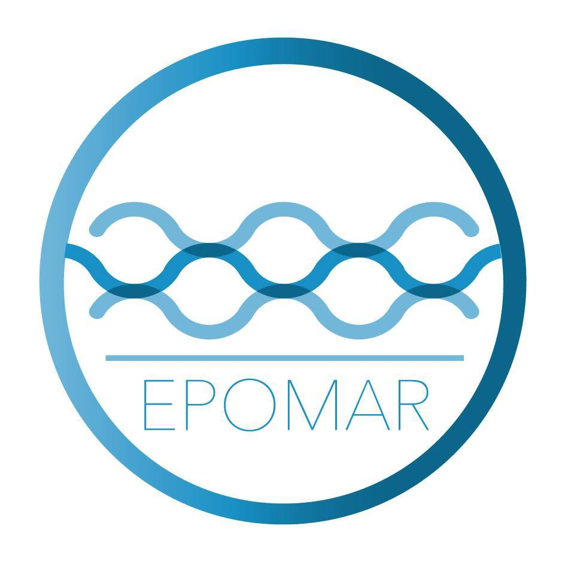

EPOMAR
================

# Repositorio

<figure>

<figcaption aria-hidden="true">Evaluación de Poblaciones Marinas
Explota</figcaption>
</figure>

El interés en investigación del laboratorio EPOMAR es en dinámica de
poblaciones explotadas, biología pesquera y evaluación de stock, con
énfasis en el desarrollo y aplicación de enfoques que faciliten tanto la
comprensión de los cambios de abundancia como la toma de decisiones para
el manejo de pesquerías.

### Informe Técnico Vol. 7 No 2 (2022)

# Indicadores biológico-pesqueros del langostino colorado y langostino amarillo

### Mayo de 2022

#### Convenio EPOMAR UdeC – Camanchaca Pesca Sur

## Including Code

``` r
#library(tidyverse)
```
